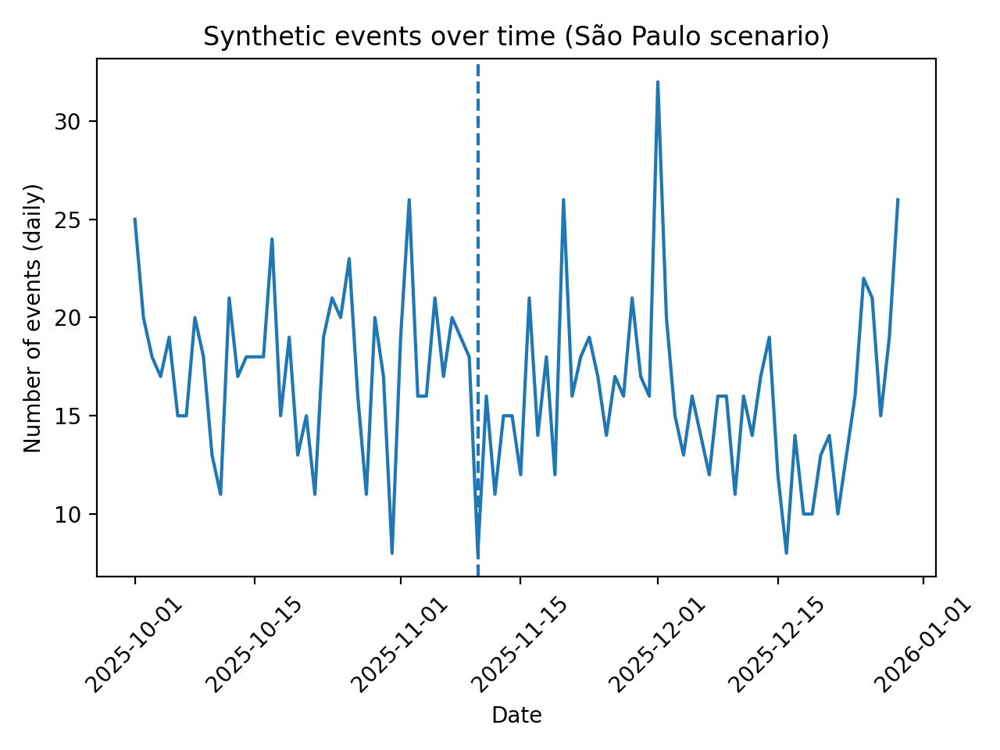
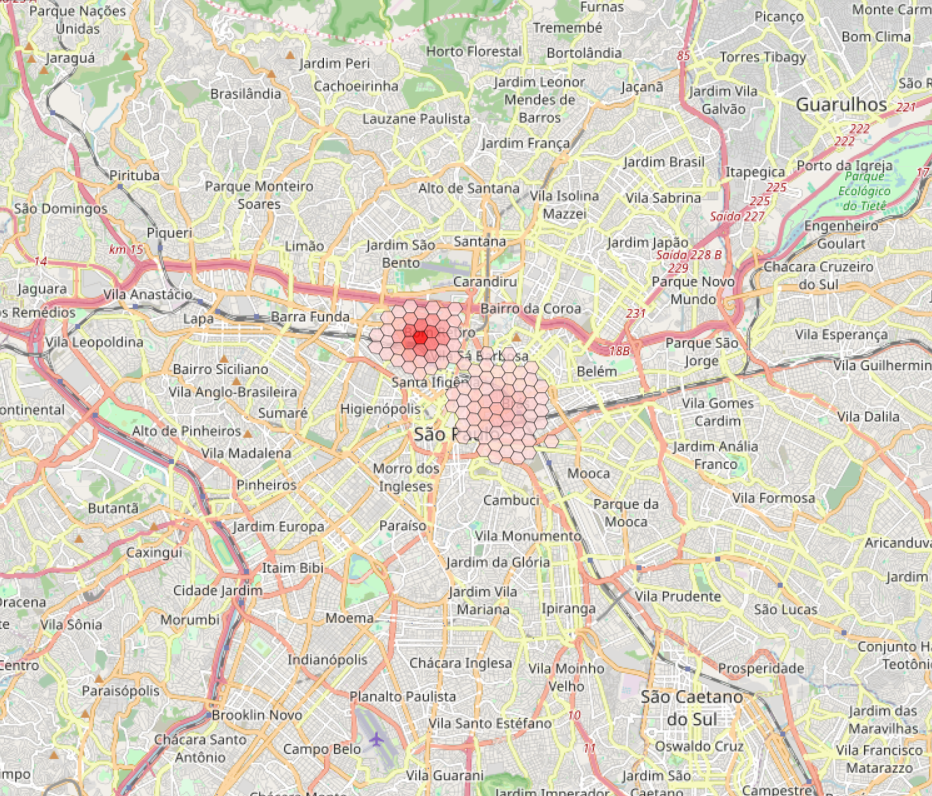
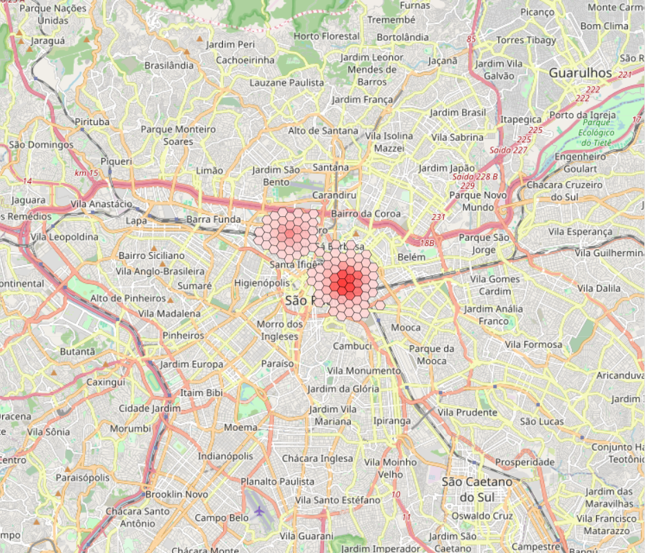

# CCD – Open Drug-Use Scenes (GIS MVP)

Open drug-use scenes represent a persistent challenge for urban governance in large metropolitan areas. Public security interventions frequently aim to reduce visibility and concentration, yet their spatial consequences remain contested.

## Research Objective

This project develops a reproducible spatial-analytical framework to assess how public security policies shape the territorial dynamics of open drug-use scenes.

The central question is not only whether interventions reduce visible drug-use activity, but how they reconfigure it spatially.

The framework evaluates:

- **Spatial configuration:** how enforcement actions reshape hotspot formation and clustering patterns  
- **Displacement dynamics:** whether interventions generate territorial spillovers rather than suppression  
- **Spatial concentration:** how unequal the distribution of events remains after policy action  
- **Qualitative mechanisms (conceptual layer):** how institutional practices and on-the-ground dynamics help explain observed spatial shifts  

The repository runs with **synthetic georeferenced data by default**, ensuring methodological transparency and reproducibility. The structure is designed to be adapted to restricted administrative datasets (e.g., police or municipal security records).


---

## Analytical Contributions of the MVP

This MVP operationalizes a policy-evaluation framework that integrates spatial analysis, causal inference, and qualitative interpretation.

### Spatial Policy Diagnostics

- **Hexagonal spatial aggregation (H3):** standardized territorial units for comparing intervention areas over time  
- **Hotspot analysis:** identification of clustering patterns before and after enforcement actions  
- **Displacement metrics:** centroid shifts and spatial dispersion indicators to detect geographic relocation  
- **Concentration measures:** Top-k share and spatial Gini coefficients to assess inequality in event distribution  

### Quasi-Experimental Policy Evaluation

- **Event-study and Difference-in-Differences (DiD):** estimation of intervention effects over time  
- **Spatial spillover analysis:** ring/buffer models to evaluate indirect territorial effects  

### Qualitative Mechanisms (Pilot Layer)

- **Semi-structured interview guide:** targeting security agents, municipal managers, outreach workers, and affected populations  
- **Initial coding framework:** displacement mechanisms, collateral effects, and integrated governance approaches  


---

##  Repository structure

ccd-gis-mvp/
│
├── data/
│ ├── raw/ # original or restricted datasets (not versioned)
│ └── processed/ # cleaned and aggregated spatial data
│
├── notebooks/ # exploratory analysis (optional)
├── src/ # reproducible scripts (main pipeline)
│
├── reports/
│ ├── figures/ # static outputs (PNG, PDF)
│ └── maps/ # interactive HTML maps
│
├── qualitative/
│ └── protocols/ # interview guides and coding frameworks
│
├── docs/ # project documentation
└── README.md


---
## Reproducibility Guide

To replicate the full analytical workflow:

```bash
python -m venv .venv
.\.venv\Scripts\Activate.ps1   # Windows
pip install -r requirements.txt
python src/run_mvp.py

Alternatively, the analysis can be executed step by step using the notebooks:

notebooks/01_synthetic_data.ipynb

notebooks/02_hotspots.ipynb

notebooks/03_event_study_spillover.ipynb

All outputs (maps, figures, and aggregated metrics) are automatically saved in:

reports/maps/

reports/figures/

data/processed/


---

## ?? Data & ethics
- Do not publish raw point-level sensitive geolocations.
- Use aggregation (H3/hex) and anonymization for any public release.
- This repository is designed to work with **synthetic data** for open sharing.

## Interactive map (São Paulo – synthetic scenario)
[Open synthetic events map](reports/maps/synthetic_events_map_sao_paulo.html)

resultados
### ?? Time series (daily events)



##  H3 Hotspots — Before vs After

[Open interactive map](reports/maps/h3_hotspots_res9_sao_paulo.html)

<p align="center">
  
  
</p>
