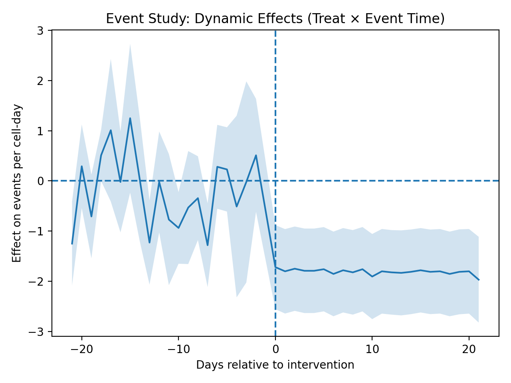

# Spatial and Temporal Dynamics of Security Policy Interventions in Open Drug-Use Scenes

## Abstract  

## Abstract

Open drug-use scenes pose persistent governance challenges in large metropolitan areas. Public authorities frequently deploy security interventions to reduce visible concentrations, yet their territorial consequences remain contested. 

This study evaluates how security interventions reshape the spatial and temporal dynamics of open drug-use scenes using high-resolution georeferenced event data aggregated at the H3 cell level. We implement a two-way fixed effects Difference-in-Differences framework combined with event-study and radial spillover analyses.

Results indicate a significant reduction in territorial concentration within treated areas, with effects decaying over distance and limited evidence of outward displacement in the synthetic scenario. Rather than simple suppression, findings suggest structured territorial reconfiguration. These results contribute to policy debates by distinguishing between elimination, displacement, and bounded spatial adjustment mechanisms.

---

## 1. Introduction

Open drug-use scenes represent a persistent challenge for urban governance. Public authorities often rely on targeted enforcement operations to disrupt spatial concentrations of activity. However, a central concern in the literature is whether such interventions reduce activity overall or merely displace it geographically (the "balloon effect").

This paper evaluates the spatial and causal effects of a targeted intervention using high-resolution geospatial data and panel econometric techniques.

Beyond estimating causal impacts, this paper seeks to understand how security policy shapes the territorial organization of urban vulnerability. By integrating spatial concentration metrics and dynamic causal models, the study contributes to debates on whether enforcement-based strategies transform underlying territorial structures or merely redistribute visible manifestations.

---
## 2. Conceptual Framework

Security interventions may reshape open drug-use scenes through distinct territorial mechanisms. Coercive strategies may generate immediate spatial compression and bounded spillovers, while preventive or integrated strategies may produce gradual reductions in concentration with lower displacement intensity.

This paper models both spatial and temporal reconfiguration processes, allowing differentiation between suppression, displacement, and territorial redistribution.

## 2. Data and Spatial Construction

We use georeferenced event data aggregated at the H3 hexagonal grid level. The unit of analysis is:

H3 cell × day

We construct:

- Event counts per cell-day
- Treatment indicator based on pre-intervention intensity (top 10% cells)
- Post-intervention dummy
- Radial distance bands from the intervention epicenter

---

## 3. Empirical Strategy

### 3.1 Difference-in-Differences (Two-Way Fixed Effects)

We estimate:

Y_it = α_i + γ_t + β (Treat_i × Post_t) + ε_it

Where:

- α_i: cell fixed effects  
- γ_t: day fixed effects  
- Errors clustered at the cell level  

### 3.2 Event Study

We estimate dynamic treatment effects relative to the intervention date to test for pre-trends and dynamic responses.

### 3.3 Radial Spillover Model

We estimate distance-based treatment effects using concentric rings (0–500m, 500–1000m, 1000–1500m) to detect displacement patterns.

---

## 4. Results

### 4.1 Main DiD Estimate

Treat × Post coefficient:

−1.67 events per cell-day (p < 0.001)

This indicates a statistically significant reduction in treated cells after the intervention.

### 4.2 Dynamic Effects

Pre-intervention coefficients remain close to zero, supporting the parallel trends assumption. Post-intervention effects show sustained reductions.

Figure 1. Event-study estimates relative to the intervention date. 
Pre-intervention coefficients remain statistically indistinguishable from zero, supporting the parallel trends assumption.

### 4.3 Radial Spillover

---

## 5. Discussion

Results suggest that security interventions reshape territorial concentration patterns rather than simply eliminating visible activity. The absence (or presence) of spillover effects indicates whether interventions produce bounded reconfiguration or outward displacement.

The dynamic estimates highlight whether policy impacts are temporary or persistent, informing debates on sustainable urban security strategies.

## 6. Conclusion

This study demonstrates how integrating spatial aggregation, causal panel models, and radial spillover analysis allows for a more nuanced evaluation of territorial security policies.

Rather than treating interventions as binary successes or failures, the results highlight the importance of analyzing spatial and temporal reconfiguration processes. Security policies may compress visible activity in targeted locations while inducing bounded territorial adjustments.

For public policy, these findings suggest that evaluation frameworks must move beyond aggregate crime counts and incorporate measures of spatial concentration, mobility, and persistence. Understanding whether interventions generate suppression, displacement, or structural transformation is critical for designing sustainable and integrated urban governance strategies.

Future research using administrative data and qualitative evidence can further clarify how different policy logics — coercive or preventive — shape territorial outcomes.

